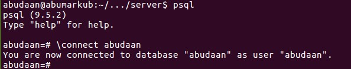
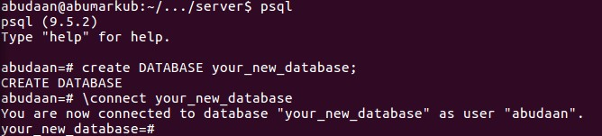
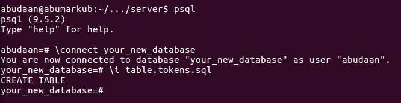

### Push Notification Server

Simple nodejs server using [express](http://expressjs.com/) webserver that can be used as provider for both GCM and APNs.


### Installation


After you have cloned the repository ```cd``` into the 'server' folder and run:

```npm install```

Next we set up a database, in this database we store the device tokens of the registered devices. Assuming you have PostgreSQL server and psql client installed run:

```psql ```

You can use your default database:

```\connect {your_username}```




Alternately you can create a new database with SQL:

```CREATE DATABASE your_new_database```




Now create a table tokens by running the file 'table.tokens.sql':

```\i table.tokens.sql```




Before we can run the server we need to have a connection key and certificate to be able to connect to APNs, and a server key for connecting to GCM. We are going to setup the first test client, which is iOS only to get a connection key and certificate for APNs. First ```cd``` to the 'client' folder.

Next we initialize react-native:

```react-native init pushtest1```

During initialization you get several conflict warnings; always choose 'n' for 'do not overwrite'


Now open the file ./client/pushtest1/ios/pushtest1.xcodeproj in Xcode.